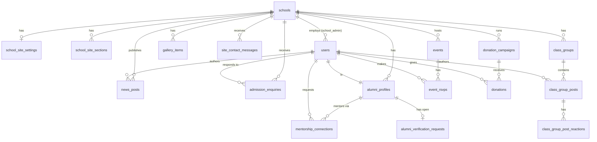

# EduSaaS — Database Schema

**Modules:** Core platform (`schools`, `accounts`) · School Site & Admin · Alumni Relations — see [designDocAlumni.md](./designDocAlumni.md) for the Alumni feature spec, and [school-site-template-wireframe.html](../wireframes/school-site-template-wireframe.html) / [school-admin-wireframes.html](../wireframes/school-admin-wireframes.html) for the site & admin surfaces.
**Engine:** PostgreSQL (per [architectureDesign.md](../architectureDesign.md) — Django + DRF + Postgres, row-level multi-tenancy)
**Status:** Design — no backend code exists yet in this repo. This is DDL-level design intended to become Django models (`schools`, `accounts`, `websites`, `alumni` apps) when the backend is scaffolded.

This document is the merged, canonical schema for the whole platform. It replaces the earlier `alumniDatabaseSchema.md` and `schoolSiteAdminDatabaseSchema.md`, which defined `schools`/`users` twice — once as minimal FK stubs (Alumni Relations) and once as the real spec (School Site & Admin). Here each table is defined exactly once.

---

## 1. Scope

- **Core platform**: `schools`, `users` — owned by no single feature; every other table hangs off these via `school_id`/user FKs.
- **School Site & Admin**: the templated public school site (hero, about, news, gallery, contact) and the admin console that edits it (site content, news, events, admissions enquiries).
- **Alumni Relations**: MoSCoW **Must Have** and **Should Have (V1.1)** tables from `designDocAlumni.md` §2.1 — alumni directory, class year groups, events, mentorship, donations, verification.
- Events (`events`, `event_rsvps`) are authored **once**, in the Alumni Relations section below — the admin Events screen and the public site's event listing read the same rows (per the admin wireframe's own note, "Same event data feeds the public site's event listing and the alumni portal — authored once here").
- Out of scope (V2, per `architectureDesign.md` §"V2 Scope"): full online applications, parent portal, fee management, student registry, job board, alumni chapters, in-platform messaging, analytics, broadcast. See §8 for the alumni V2 roadmap names.

## 2. Multi-tenancy rule

Every table below is scoped to a school. Tables queried directly by tenant (not just joined through a parent) carry a **denormalized `school_id`** column, even where it's technically derivable through a FK chain (e.g. `class_group_posts.class_group_id → class_groups.school_id`). This lets every query and every future Postgres Row-Level Security (RLS) policy filter on `school_id` directly with an index, without a join, and without relying on application code getting the join right every time.

Recommendation: once the backend exists, enable RLS on all tables below with a policy like:

```sql
CREATE POLICY tenant_isolation ON alumni_profiles
  USING (school_id = current_setting('app.current_school_id')::uuid);
```

This is defense-in-depth on top of (not a replacement for) the Django query-manager scoping already called for in the architecture doc.

---

## 3. Core platform — `schools` and `accounts`

### `schools`

```sql
CREATE TABLE schools (
  id                         uuid PRIMARY KEY DEFAULT gen_random_uuid(),
  name                       text NOT NULL,
  slug                       varchar(63) UNIQUE NOT NULL,     -- DNS-safe: lowercase, hyphens, no underscores
  country                    varchar(2) NOT NULL,             -- ISO 3166-1 alpha-2: "GM" | "ZW"

  -- custom domain (premium tier) — see docs/domainRoutingArchitecture.md §3
  custom_domain              text UNIQUE,
  domain_status              varchar(20) NOT NULL DEFAULT 'none'
    CHECK (domain_status IN ('none','pending_dns','pending_ssl','active','failed')),
  domain_verification_token  text,
  domain_added_at            timestamptz,
  domain_activated_at        timestamptz,

  network                    varchar(120),                    -- nullable grouping tag, no routing implication (domain doc §7)

  created_at                 timestamptz NOT NULL DEFAULT now(),
  updated_at                 timestamptz NOT NULL DEFAULT now()
);

-- Reserved slugs so no school can claim e.g. admin.edusaas.africa (domain doc §"Edge cases")
-- Enforced at the application layer at creation time, not a DB constraint (reserved list changes independently of schema).
```

### `users`

```sql
CREATE TABLE users (
  id            uuid PRIMARY KEY DEFAULT gen_random_uuid(),
  phone         text UNIQUE NOT NULL,          -- E.164, e.g. +2203121164
  email         text UNIQUE,
  name          text NOT NULL,
  password_hash text NOT NULL,
  role          varchar(20) NOT NULL
    CHECK (role IN ('super_admin','school_admin','alumni')),  -- teacher/parent/student deferred to V2
  school_id     uuid REFERENCES schools(id) ON DELETE CASCADE, -- set only for school_admin; null for super_admin/alumni
  avatar_url    text,
  created_at    timestamptz NOT NULL DEFAULT now(),
  updated_at    timestamptz NOT NULL DEFAULT now(),
  CHECK (role != 'school_admin' OR school_id IS NOT NULL)
);

CREATE INDEX idx_users_school_admins ON users (school_id) WHERE role = 'school_admin';
```

A school can have more than one `school_admin` (plain FK, not unique) — the wireframe's single admin avatar is just the logged-in user, not a cardinality constraint. Alumni users are linked to a school via `alumni_profiles.school_id` (§6), not via this column.

---

## 4. Entity relationship diagram



---

## 5. School Site & Admin — website content

The admin dashboard edits are **draft-first**: "Publish changes" pushes to the live site, so half-written copy never goes public. The wireframe shows this per-section (Hero badged `Live`, About badged `Unpublished edit`), so draft/publish state is tracked per section rather than per school.

### `school_site_settings`

Structural/branding chrome — the parts of the site that aren't prose content. One row per school.

```sql
CREATE TABLE school_site_settings (
  id              uuid PRIMARY KEY DEFAULT gen_random_uuid(),
  school_id       uuid NOT NULL UNIQUE REFERENCES schools(id) ON DELETE CASCADE,
  logo_url        text,
  primary_color   varchar(7),                       -- hex, e.g. "#1d9e75"
  secondary_color varchar(7),
  content_blocks  jsonb NOT NULL DEFAULT '[]',       -- ordered, toggleable sections; see docs/domainRoutingArchitecture.md §3
  updated_at      timestamptz NOT NULL DEFAULT now()
);
```

`content_blocks` shape (from the domain routing doc, unchanged here):

```json
[
  { "type": "hero", "enabled": true },
  { "type": "news", "enabled": true, "order": 1 },
  { "type": "gallery", "enabled": true, "order": 2 },
  { "type": "events", "enabled": true, "order": 3 }
]
```

### `school_site_sections`

The editable prose/media content behind the Hero, About, and Contact panels — each independently draftable and publishable.

```sql
CREATE TABLE school_site_sections (
  id              uuid PRIMARY KEY DEFAULT gen_random_uuid(),
  school_id       uuid NOT NULL REFERENCES schools(id) ON DELETE CASCADE,
  section_key     varchar(20) NOT NULL CHECK (section_key IN ('hero','about','contact')),
  draft_data      jsonb NOT NULL DEFAULT '{}',       -- what the admin is currently editing
  published_data  jsonb,                             -- last-published snapshot; null until first publish
  published_at    timestamptz,
  updated_at      timestamptz NOT NULL DEFAULT now(),
  UNIQUE (school_id, section_key)
);

CREATE INDEX idx_school_site_sections_school ON school_site_sections (school_id);
```

A section is "unpublished" (draft badge) whenever `draft_data IS DISTINCT FROM published_data` — computed at read time, not stored, so there's no risk of the flag drifting from the actual data.

**`draft_data` / `published_data` shapes** (by `section_key`, matching the wireframe fields directly):

```jsonc
// hero
{ "eyebrow": "Est. 1978 · Junior & Senior Secondary",
  "headline": "Educating tomorrow's leaders in Lamin",
  "subtext": "A comprehensive technical secondary school...",
  "hero_image_url": "..." }

// about
{ "body": "St. Peter's Technical Junior & Senior Secondary School has served...",
  "students_enrolled": 1200, "years_of_history": 38, "alumni_registered_display": 500,
  "grades_offered": "Grades 7–12", "location_label": "Lamin, WCR", "language_of_instruction": "English" }

// contact
{ "address": "Lamin Village, Kombo North, West Coast Region",
  "phone": "+220 XXX XXXX", "email": "info@stpeterstechnical.edusaas.africa",
  "office_hours": "Mon–Fri, 8:00–16:00" }
```

`alumni_registered_display` is a manually-set display number on the public hero stat, independent of the live count in `alumni_profiles` — the wireframe treats it as editable copy, not a computed metric, so school admins aren't blocked on backend aggregation to update it.

### `news_posts`

One compose flow, one publish action, two possible audiences — the public site and the alumni feed read from the same rows (per the admin wireframe's own note and the design doc's survey data on news being a top alumni want).

```sql
CREATE TABLE news_posts (
  id              uuid PRIMARY KEY DEFAULT gen_random_uuid(),
  school_id       uuid NOT NULL REFERENCES schools(id) ON DELETE CASCADE,
  author_id       uuid NOT NULL REFERENCES users(id),
  title           varchar(200) NOT NULL,
  cover_image_url text,
  body            text NOT NULL,
  audience        varchar(10) NOT NULL DEFAULT 'public'
    CHECK (audience IN ('public','alumni','both')),
  notify_whatsapp boolean NOT NULL DEFAULT false,      -- opt-in push; rate limit (2/week) enforced app-side, not here
  status          varchar(10) NOT NULL DEFAULT 'draft'
    CHECK (status IN ('draft','published')),
  published_at    timestamptz,
  created_at      timestamptz NOT NULL DEFAULT now(),
  updated_at      timestamptz NOT NULL DEFAULT now()
);

CREATE INDEX idx_news_posts_public_feed ON news_posts (school_id, published_at DESC)
  WHERE status = 'published' AND audience IN ('public','both');
CREATE INDEX idx_news_posts_alumni_feed ON news_posts (school_id, published_at DESC)
  WHERE status = 'published' AND audience IN ('alumni','both');
```

The per-audience WhatsApp send cap (2/week, from the wireframe's field hint) is a rate-limit rule applied by the Celery task that fans out notifications, not something expressible as a table constraint.

### `gallery_items`

```sql
CREATE TABLE gallery_items (
  id           uuid PRIMARY KEY DEFAULT gen_random_uuid(),
  school_id    uuid NOT NULL REFERENCES schools(id) ON DELETE CASCADE,
  image_url    text NOT NULL,
  caption      text,
  layout_span  varchar(10) NOT NULL DEFAULT 'normal'
    CHECK (layout_span IN ('normal','tall','wide')),   -- mirrors the public site's masonry grid classes
  sort_order   integer NOT NULL DEFAULT 0,
  created_at   timestamptz NOT NULL DEFAULT now()
);

CREATE INDEX idx_gallery_items_school_order ON gallery_items (school_id, sort_order);
```

### `site_contact_messages` and `admission_enquiries`

Two distinct forms in the wireframes, kept as separate tables since they serve different purposes and have different admin-facing workflows.

`site_contact_messages` is the generic "Get in touch" box at the bottom of the public site — a simple message drop, no triage state beyond new/responded.

```sql
CREATE TABLE site_contact_messages (
  id             uuid PRIMARY KEY DEFAULT gen_random_uuid(),
  school_id      uuid NOT NULL REFERENCES schools(id) ON DELETE CASCADE,
  full_name      varchar(150) NOT NULL,
  contact_value  varchar(255) NOT NULL,        -- email or phone, single field per the wireframe
  message        text NOT NULL,
  status         varchar(10) NOT NULL DEFAULT 'new'
    CHECK (status IN ('new','responded')),
  created_at     timestamptz NOT NULL DEFAULT now()
);

CREATE INDEX idx_site_contact_messages_inbox ON site_contact_messages (school_id, status, created_at DESC);
```

`admission_enquiries` backs the `/enquire` flow (V2, per the admin wireframe's own label — deliberately short, not a full application) and its admin inbox.

```sql
CREATE TABLE admission_enquiries (
  id                    uuid PRIMARY KEY DEFAULT gen_random_uuid(),
  school_id             uuid NOT NULL REFERENCES schools(id) ON DELETE CASCADE,
  enquirer_type         varchar(20) NOT NULL
    CHECK (enquirer_type IN ('parent_guardian','prospective_student')),
  full_name             varchar(150) NOT NULL,
  phone                 text NOT NULL,           -- primary contact channel, per WhatsApp usage data in the design doc
  email                 text,
  grade_of_interest     varchar(50),
  intended_start_term   varchar(50),
  message               text,
  status                varchar(10) NOT NULL DEFAULT 'new'
    CHECK (status IN ('new','responded')),
  responded_by          uuid REFERENCES users(id),
  responded_at          timestamptz,
  created_at            timestamptz NOT NULL DEFAULT now()
);

CREATE INDEX idx_admission_enquiries_queue ON admission_enquiries (school_id, status, created_at DESC);
```

---

## 6. Alumni Relations — directory

### `alumni_profiles`

The core entity of the module — one row per alumnus, one-to-one with `users`.

```sql
CREATE TABLE alumni_profiles (
  id                   uuid PRIMARY KEY DEFAULT gen_random_uuid(),
  user_id              uuid NOT NULL UNIQUE REFERENCES users(id) ON DELETE CASCADE,
  school_id            uuid NOT NULL REFERENCES schools(id) ON DELETE CASCADE,

  graduation_year      smallint NOT NULL
    CHECK (graduation_year BETWEEN 1950 AND date_part('year', now())::int + 1),
  class_section        varchar(100),                  -- "Form 5A", "Upper 6 Arts"

  current_city         varchar(120),
  current_country      varchar(2),                    -- ISO 3166-1 alpha-2
  profession           varchar(150),
  employer             varchar(150),
  bio                  text,
  linkedin_url         text,

  -- A5 lightweight verification (honor system, not identity-proof)
  verification_status  varchar(20) NOT NULL DEFAULT 'unverified'
    CHECK (verification_status IN ('unverified','pending','verified','rejected')),
  verification_answer  text,                          -- e.g. answer to "name a teacher"

  -- A7 mentorship opt-in
  is_mentor            boolean NOT NULL DEFAULT false,
  mentor_areas         text[] NOT NULL DEFAULT '{}',  -- career | university | tutoring | general

  -- per-field privacy, default: name + grad year always visible (name lives on users)
  visibility           jsonb NOT NULL DEFAULT
    '{"city": true, "profession": true, "bio": true, "employer": false, "linkedin": false}',

  deleted_at           timestamptz,                    -- GDPR-lite soft delete (design doc §7)
  created_at           timestamptz NOT NULL DEFAULT now(),
  updated_at           timestamptz NOT NULL DEFAULT now()
);

CREATE INDEX idx_alumni_profiles_school_year ON alumni_profiles (school_id, graduation_year)
  WHERE deleted_at IS NULL;
CREATE INDEX idx_alumni_profiles_school_city ON alumni_profiles (school_id, current_city)
  WHERE deleted_at IS NULL;
CREATE INDEX idx_alumni_profiles_mentors ON alumni_profiles (school_id)
  WHERE is_mentor = true AND deleted_at IS NULL;
```

**Notes**

- `mentor_areas` uses a Postgres array rather than a join table — the set is small, closed, and never queried independently of the profile (matches design doc's `["career", "university", "tutoring"]` shape).
- Name search: alumni names live on `users.name`. When the backend exists, add a `pg_trgm` GIN index on `users.name` for fuzzy directory search rather than duplicating name onto this table.
- `verification_status` is a tri-state, not the earlier draft's `is_verified boolean` — A12 ("school admin can verify/approve") needs a `pending` state to drive the admin queue in `alumni_verification_requests` below.

### `alumni_verification_requests`

Backs A12 (school admin verification queue). Kept as a separate append-friendly log rather than fields bolted onto `alumni_profiles`, so the review history isn't lost on re-verification.

```sql
CREATE TABLE alumni_verification_requests (
  id                        uuid PRIMARY KEY DEFAULT gen_random_uuid(),
  alumni_profile_id         uuid NOT NULL REFERENCES alumni_profiles(id) ON DELETE CASCADE,
  school_id                 uuid NOT NULL REFERENCES schools(id) ON DELETE CASCADE,
  verification_answer_snap  text NOT NULL,             -- snapshot at time of request
  status                    varchar(20) NOT NULL DEFAULT 'pending'
    CHECK (status IN ('pending','approved','rejected')),
  reviewed_by               uuid REFERENCES users(id),  -- school_admin
  reviewer_notes            text,
  created_at                timestamptz NOT NULL DEFAULT now(),
  reviewed_at               timestamptz
);

-- Only one open (pending) request per profile at a time
CREATE UNIQUE INDEX uq_alumni_verification_pending
  ON alumni_verification_requests (alumni_profile_id)
  WHERE status = 'pending';

CREATE INDEX idx_alumni_verification_school_queue
  ON alumni_verification_requests (school_id, status);
```

---

## 7. Alumni Relations — class groups, events, mentorship, donations

### `class_groups`

```sql
CREATE TABLE class_groups (
  id                uuid PRIMARY KEY DEFAULT gen_random_uuid(),
  school_id         uuid NOT NULL REFERENCES schools(id) ON DELETE CASCADE,
  graduation_year   smallint NOT NULL,
  name              varchar(50) NOT NULL,              -- auto: "Class of 2015"
  created_at        timestamptz NOT NULL DEFAULT now(),
  UNIQUE (school_id, graduation_year)
);
```

One row auto-created (application-layer, on first alumni of a given year) per `(school_id, graduation_year)`. Membership is implicit — any alumni profile with a matching `school_id` + `graduation_year` belongs; there is no separate membership table since that would just duplicate `alumni_profiles`.

### `class_group_posts`

```sql
CREATE TABLE class_group_posts (
  id               uuid PRIMARY KEY DEFAULT gen_random_uuid(),
  class_group_id   uuid NOT NULL REFERENCES class_groups(id) ON DELETE CASCADE,
  school_id        uuid NOT NULL REFERENCES schools(id) ON DELETE CASCADE,  -- denormalized, see §2
  author_id        uuid NOT NULL REFERENCES users(id) ON DELETE CASCADE,
  content          text NOT NULL CHECK (char_length(content) <= 2000),
  image_url        text,
  deleted_at       timestamptz,                        -- soft delete for moderation
  created_at       timestamptz NOT NULL DEFAULT now(),
  updated_at       timestamptz NOT NULL DEFAULT now()
);

CREATE INDEX idx_class_group_posts_feed
  ON class_group_posts (class_group_id, created_at DESC)
  WHERE deleted_at IS NULL;
```

### `class_group_post_reactions`

```sql
CREATE TABLE class_group_post_reactions (
  id           uuid PRIMARY KEY DEFAULT gen_random_uuid(),
  post_id      uuid NOT NULL REFERENCES class_group_posts(id) ON DELETE CASCADE,
  user_id      uuid NOT NULL REFERENCES users(id) ON DELETE CASCADE,
  type         varchar(20) NOT NULL DEFAULT 'like',
  created_at   timestamptz NOT NULL DEFAULT now(),
  UNIQUE (post_id, user_id)
);
```

Not carrying `school_id` here — this table is always accessed by `post_id` (already indexed and scoped one hop away), and reaction volume per post is small, so the extra denormalization isn't earning its keep.

### `events` and `event_rsvps`

Authored once here; read by both the admin Events screen and the public site's event listing (§5).

```sql
CREATE TABLE events (
  id               uuid PRIMARY KEY DEFAULT gen_random_uuid(),
  school_id        uuid NOT NULL REFERENCES schools(id) ON DELETE CASCADE,
  created_by       uuid NOT NULL REFERENCES users(id),
  title            varchar(200) NOT NULL,
  description      text,
  event_date       timestamptz NOT NULL,
  end_date         timestamptz,
  location         varchar(255),
  location_type    varchar(20) NOT NULL DEFAULT 'physical'
    CHECK (location_type IN ('physical','virtual','hybrid')),
  virtual_link     text,
  cover_image_url  text,
  is_published     boolean NOT NULL DEFAULT false,
  created_at       timestamptz NOT NULL DEFAULT now(),
  updated_at       timestamptz NOT NULL DEFAULT now(),
  CHECK (end_date IS NULL OR end_date >= event_date)
);

CREATE INDEX idx_events_school_upcoming ON events (school_id, event_date)
  WHERE is_published = true;

CREATE TABLE event_rsvps (
  id           uuid PRIMARY KEY DEFAULT gen_random_uuid(),
  event_id     uuid NOT NULL REFERENCES events(id) ON DELETE CASCADE,
  school_id    uuid NOT NULL REFERENCES schools(id) ON DELETE CASCADE,  -- denormalized, see §2
  user_id      uuid NOT NULL REFERENCES users(id) ON DELETE CASCADE,
  status       varchar(20) NOT NULL CHECK (status IN ('going','maybe','not_going')),
  created_at   timestamptz NOT NULL DEFAULT now(),
  updated_at   timestamptz NOT NULL DEFAULT now(),
  UNIQUE (event_id, user_id)
);

CREATE INDEX idx_event_rsvps_event_status ON event_rsvps (event_id, status);
```

### `mentorship_connections` (V1.1 — A7)

`alumni_profiles.is_mentor` / `mentor_areas` cover the opt-in side. This table backs the connection-request flow.

```sql
CREATE TABLE mentorship_connections (
  id              uuid PRIMARY KEY DEFAULT gen_random_uuid(),
  school_id       uuid NOT NULL REFERENCES schools(id) ON DELETE CASCADE,  -- denormalized, see §2
  mentor_id       uuid NOT NULL REFERENCES alumni_profiles(id) ON DELETE CASCADE,
  requester_id    uuid NOT NULL REFERENCES users(id) ON DELETE CASCADE,
  area            varchar(50) NOT NULL,           -- career | university | tutoring | general
  message         text,
  status          varchar(20) NOT NULL DEFAULT 'pending'
    CHECK (status IN ('pending','accepted','declined','closed')),
  created_at      timestamptz NOT NULL DEFAULT now(),
  updated_at      timestamptz NOT NULL DEFAULT now()
);

CREATE INDEX idx_mentorship_mentor_queue ON mentorship_connections (mentor_id, status);
```

App layer must enforce `mentor_id` refers to a profile with `is_mentor = true` — not expressible as a plain `CHECK` constraint across tables in Postgres without a trigger, and a trigger is overkill for a V1.1 feature.

### `donation_campaigns` and `donations` (V1.1 — A6)

```sql
CREATE TABLE donation_campaigns (
  id            uuid PRIMARY KEY DEFAULT gen_random_uuid(),
  school_id     uuid NOT NULL REFERENCES schools(id) ON DELETE CASCADE,
  title         varchar(200) NOT NULL,
  description   text,
  goal_amount   integer NOT NULL CHECK (goal_amount > 0),  -- smallest currency unit (e.g. cents/tambala-equiv)
  currency      varchar(3) NOT NULL DEFAULT 'GMD'
    CHECK (currency IN ('GMD','ZWL','USD')),
  deadline      timestamptz,
  is_active     boolean NOT NULL DEFAULT true,
  created_at    timestamptz NOT NULL DEFAULT now(),
  updated_at    timestamptz NOT NULL DEFAULT now()
);

CREATE TABLE donations (
  id              uuid PRIMARY KEY DEFAULT gen_random_uuid(),
  campaign_id     uuid NOT NULL REFERENCES donation_campaigns(id) ON DELETE RESTRICT,
  school_id       uuid NOT NULL REFERENCES schools(id) ON DELETE RESTRICT,  -- denormalized, see §2
  donor_id        uuid NOT NULL REFERENCES users(id),
  amount          integer NOT NULL CHECK (amount > 0),
  currency        varchar(3) NOT NULL,
  payment_method  varchar(20) NOT NULL
    CHECK (payment_method IN ('wave','ecocash','paynow','stripe')),
  payment_ref     varchar(255) UNIQUE,             -- external transaction id; idempotency key
  is_anonymous    boolean NOT NULL DEFAULT false,
  status          varchar(20) NOT NULL DEFAULT 'pending'
    CHECK (status IN ('pending','completed','failed','refunded')),
  created_at      timestamptz NOT NULL DEFAULT now(),
  updated_at      timestamptz NOT NULL DEFAULT now()
);

CREATE INDEX idx_donations_campaign_status ON donations (campaign_id, status);
```

`ON DELETE RESTRICT` on the financial tables (not `CASCADE`) — a campaign or school row should never be hard-deletable once real money has moved through it; that path should go through soft-delete/archival at the application layer instead.

---

## 8. V2 roadmap (not designed yet — names only)

These correspond to `designDocAlumni.md` §2.1 Could Have (A9–A14), plus the non-alumni V2 items noted in §1. Deliberately left unspecced: the product decisions behind them aren't settled, so DDL now would just be guesswork to redo later.

| Future table | Backs |
|---|---|
| `job_postings` | A9 Job Board |
| `alumni_chapters`, `alumni_chapter_memberships` | A10 Alumni Chapters |
| `direct_messages` | A11 In-Platform Messaging |
| (analytics likely read-model/materialized views, not new source tables) | A13 Analytics Dashboard |
| `broadcast_messages` | A14 SMS/WhatsApp Broadcast |

---

## 9. Naming & conventions used above

- `uuid` PKs via `gen_random_uuid()` (`pgcrypto` extension) — avoids sequential-ID enumeration of records across schools.
- Money stored as integer smallest-currency-unit, never `float`/`numeric` with implied decimals guessed at query time.
- `timestamptz` everywhere (not bare `timestamp`) — the platform spans GMT (Gambia) and CAT (Zimbabwe); avoid ambiguous local-time storage.
- Enums as `varchar` + `CHECK`, not native Postgres `ENUM` types, so adding a value later is a constraint change, not a type migration.
- `jsonb` used only where the shape is genuinely open-ended or app-defined (`content_blocks`, section copy) — never as a substitute for columns that are actually queried or constrained individually.
- Soft delete (`deleted_at`) only where design doc §7 requires user-initiated data removal (`alumni_profiles`) or moderation (`class_group_posts`) — not added reflexively to every table. School site/admin tables hold no user-initiated personal data subject to a deletion request the way `alumni_profiles` does, so none of them get it either.
