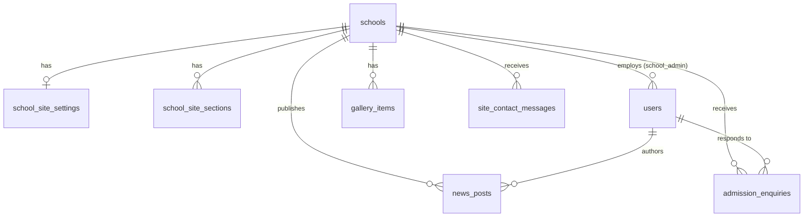

# School Site & Admin — Database Schema

**Modules:** Core platform (`schools`, `accounts`) + public school website + school admin console — see [school-site-template-wireframe.html](../wireframes/school-site-template-wireframe.html) and [school-admin-wireframes.html](../wireframes/school-admin-wireframes.html)
**Engine:** PostgreSQL (per [architectureDesign.md](../architectureDesign.md) — Django + DRF + Postgres, row-level multi-tenancy)
**Status:** Design — no backend code exists yet in this repo. DDL-level design intended to become Django models (`schools`, `accounts`, `websites` apps per the architecture doc) when the backend is scaffolded.

This document covers the **non-alumni** surfaces: the templated public school site (hero, about, news, gallery, contact) and the school admin console that edits it (site content, news, events, enquiries). It also owns the canonical definition of `schools` and `users`, which other modules — including Alumni Relations — depend on via foreign key.

Events (`events`, `event_rsvps`) are **not** redefined here. The admin Events screen and the public site's event listing read the same rows the Alumni Relations schema already specs (`docs/alumniDatabaseSchema.md`, branch `alumniSchemas`, not yet merged) — one authoring surface, per the admin wireframe's own note ("Same event data feeds the public site's event listing and the alumni portal — authored once here").

---

## 1. Scope

Covers every screen in the two wireframes above:

- **Public site template**: nav/brand, hero, about, news grid, gallery, contact form, footer.
- **Admin dashboard**: site content editor (draft → publish), news & announcements composer, events (see note above — no new tables), admissions enquiry inbox.

Out of scope (V2, per `architectureDesign.md` §"V2 Scope"): full online applications, parent portal, fee management, student registry. The `admission_enquiries` table below backs the *enquiry* form only (explicitly "not a full application" per the wireframe's own copy).

## 2. Multi-tenancy rule

Same rule as the Alumni Relations schema: every table below carries a `school_id`, including where it's one hop from a school-scoped parent (e.g. `news_posts.author_id → users`), so every query and future Postgres Row-Level Security policy can filter on `school_id` directly. See `architectureDesign.md` §"Database" and `docs/alumniDatabaseSchema.md` §2 for the RLS policy shape — the same `CREATE POLICY tenant_isolation ... USING (school_id = current_setting('app.current_school_id')::uuid)` pattern applies to every table here.

## 3. Entity relationship diagram



---

## 4. Core platform — `schools` and `accounts`

These replace the minimal stubs the Alumni Relations schema uses for FK context only — this is the real spec.

### `schools`

```sql
CREATE TABLE schools (
  id                         uuid PRIMARY KEY DEFAULT gen_random_uuid(),
  name                       text NOT NULL,
  slug                       varchar(63) UNIQUE NOT NULL,     -- DNS-safe: lowercase, hyphens, no underscores
  country                    varchar(2) NOT NULL,             -- ISO 3166-1 alpha-2: "GM" | "ZW"

  -- custom domain (premium tier) — see docs/domainRoutingArchitecture.md §3
  custom_domain              text UNIQUE,
  domain_status              varchar(20) NOT NULL DEFAULT 'none'
    CHECK (domain_status IN ('none','pending_dns','pending_ssl','active','failed')),
  domain_verification_token  text,
  domain_added_at            timestamptz,
  domain_activated_at        timestamptz,

  network                    varchar(120),                    -- nullable grouping tag, no routing implication (domain doc §7)

  created_at                 timestamptz NOT NULL DEFAULT now(),
  updated_at                 timestamptz NOT NULL DEFAULT now()
);

-- Reserved slugs so no school can claim e.g. admin.edusaas.africa (domain doc §"Edge cases")
-- Enforced at the application layer at creation time, not a DB constraint (reserved list changes independently of schema).
```

### `users`

```sql
CREATE TABLE users (
  id            uuid PRIMARY KEY DEFAULT gen_random_uuid(),
  phone         text UNIQUE NOT NULL,          -- E.164, e.g. +2203121164
  email         text UNIQUE,
  name          text NOT NULL,
  password_hash text NOT NULL,
  role          varchar(20) NOT NULL
    CHECK (role IN ('super_admin','school_admin','alumni')),  -- teacher/parent/student deferred to V2
  school_id     uuid REFERENCES schools(id) ON DELETE CASCADE, -- set only for school_admin; null for super_admin/alumni
  avatar_url    text,
  created_at    timestamptz NOT NULL DEFAULT now(),
  updated_at    timestamptz NOT NULL DEFAULT now(),
  CHECK (role != 'school_admin' OR school_id IS NOT NULL)
);

CREATE INDEX idx_users_school_admins ON users (school_id) WHERE role = 'school_admin';
```

A school can have more than one `school_admin` (plain FK, not unique) — the wireframe's single admin avatar is just the logged-in user, not a cardinality constraint. Alumni users are linked to a school via `alumni_profiles.school_id` (Alumni Relations schema), not via this column.

---

## 5. Website — site content (admin "Site content" tab)

The admin dashboard edits are **draft-first**: "Publish changes" pushes to the live site, so half-written copy never goes public. The wireframe shows this per-section (Hero badged `Live`, About badged `Unpublished edit`), so draft/publish state is tracked per section rather than per school.

### `school_site_settings`

Structural/branding chrome — the parts of the site that aren't prose content. One row per school.

```sql
CREATE TABLE school_site_settings (
  id              uuid PRIMARY KEY DEFAULT gen_random_uuid(),
  school_id       uuid NOT NULL UNIQUE REFERENCES schools(id) ON DELETE CASCADE,
  logo_url        text,
  primary_color   varchar(7),                       -- hex, e.g. "#1d9e75"
  secondary_color varchar(7),
  content_blocks  jsonb NOT NULL DEFAULT '[]',       -- ordered, toggleable sections; see docs/domainRoutingArchitecture.md §3
  updated_at      timestamptz NOT NULL DEFAULT now()
);
```

`content_blocks` shape (from the domain routing doc, unchanged here):

```json
[
  { "type": "hero", "enabled": true },
  { "type": "news", "enabled": true, "order": 1 },
  { "type": "gallery", "enabled": true, "order": 2 },
  { "type": "events", "enabled": true, "order": 3 }
]
```

### `school_site_sections`

The editable prose/media content behind the Hero, About, and Contact panels — each independently draftable and publishable.

```sql
CREATE TABLE school_site_sections (
  id              uuid PRIMARY KEY DEFAULT gen_random_uuid(),
  school_id       uuid NOT NULL REFERENCES schools(id) ON DELETE CASCADE,
  section_key     varchar(20) NOT NULL CHECK (section_key IN ('hero','about','contact')),
  draft_data      jsonb NOT NULL DEFAULT '{}',       -- what the admin is currently editing
  published_data  jsonb,                             -- last-published snapshot; null until first publish
  published_at    timestamptz,
  updated_at      timestamptz NOT NULL DEFAULT now(),
  UNIQUE (school_id, section_key)
);

CREATE INDEX idx_school_site_sections_school ON school_site_sections (school_id);
```

A section is "unpublished" (draft badge) whenever `draft_data IS DISTINCT FROM published_data` — computed at read time, not stored, so there's no risk of the flag drifting from the actual data.

**`draft_data` / `published_data` shapes** (by `section_key`, matching the wireframe fields directly):

```jsonc
// hero
{ "eyebrow": "Est. 1978 · Junior & Senior Secondary",
  "headline": "Educating tomorrow's leaders in Lamin",
  "subtext": "A comprehensive technical secondary school...",
  "hero_image_url": "..." }

// about
{ "body": "St. Peter's Technical Junior & Senior Secondary School has served...",
  "students_enrolled": 1200, "years_of_history": 38, "alumni_registered_display": 500,
  "grades_offered": "Grades 7–12", "location_label": "Lamin, WCR", "language_of_instruction": "English" }

// contact
{ "address": "Lamin Village, Kombo North, West Coast Region",
  "phone": "+220 XXX XXXX", "email": "info@stpeterstechnical.edusaas.africa",
  "office_hours": "Mon–Fri, 8:00–16:00" }
```

`alumni_registered_display` is a manually-set display number on the public hero stat, independent of the live count in `alumni_profiles` — the wireframe treats it as editable copy, not a computed metric, so school admins aren't blocked on backend aggregation to update it.

---

## 6. Website — news & announcements

One compose flow, one publish action, two possible audiences — the public site and the alumni feed read from the same rows (per the admin wireframe's own note and the design doc's survey data on news being a top alumni want).

```sql
CREATE TABLE news_posts (
  id              uuid PRIMARY KEY DEFAULT gen_random_uuid(),
  school_id       uuid NOT NULL REFERENCES schools(id) ON DELETE CASCADE,
  author_id       uuid NOT NULL REFERENCES users(id),
  title           varchar(200) NOT NULL,
  cover_image_url text,
  body            text NOT NULL,
  audience        varchar(10) NOT NULL DEFAULT 'public'
    CHECK (audience IN ('public','alumni','both')),
  notify_whatsapp boolean NOT NULL DEFAULT false,      -- opt-in push; rate limit (2/week) enforced app-side, not here
  status          varchar(10) NOT NULL DEFAULT 'draft'
    CHECK (status IN ('draft','published')),
  published_at    timestamptz,
  created_at      timestamptz NOT NULL DEFAULT now(),
  updated_at      timestamptz NOT NULL DEFAULT now()
);

CREATE INDEX idx_news_posts_public_feed ON news_posts (school_id, published_at DESC)
  WHERE status = 'published' AND audience IN ('public','both');
CREATE INDEX idx_news_posts_alumni_feed ON news_posts (school_id, published_at DESC)
  WHERE status = 'published' AND audience IN ('alumni','both');
```

The per-audience WhatsApp send cap (2/week, from the wireframe's field hint) is a rate-limit rule applied by the Celery task that fans out notifications, not something expressible as a table constraint.

---

## 7. Website — gallery

```sql
CREATE TABLE gallery_items (
  id           uuid PRIMARY KEY DEFAULT gen_random_uuid(),
  school_id    uuid NOT NULL REFERENCES schools(id) ON DELETE CASCADE,
  image_url    text NOT NULL,
  caption      text,
  layout_span  varchar(10) NOT NULL DEFAULT 'normal'
    CHECK (layout_span IN ('normal','tall','wide')),   -- mirrors the public site's masonry grid classes
  sort_order   integer NOT NULL DEFAULT 0,
  created_at   timestamptz NOT NULL DEFAULT now()
);

CREATE INDEX idx_gallery_items_school_order ON gallery_items (school_id, sort_order);
```

---

## 8. Website — contact & admissions enquiries

Two distinct forms in the wireframes, kept as separate tables since they serve different purposes and have different admin-facing workflows.

### `site_contact_messages`

The generic "Get in touch" box at the bottom of the public site — a simple message drop, no triage state beyond new/responded.

```sql
CREATE TABLE site_contact_messages (
  id             uuid PRIMARY KEY DEFAULT gen_random_uuid(),
  school_id      uuid NOT NULL REFERENCES schools(id) ON DELETE CASCADE,
  full_name      varchar(150) NOT NULL,
  contact_value  varchar(255) NOT NULL,        -- email or phone, single field per the wireframe
  message        text NOT NULL,
  status         varchar(10) NOT NULL DEFAULT 'new'
    CHECK (status IN ('new','responded')),
  created_at     timestamptz NOT NULL DEFAULT now()
);

CREATE INDEX idx_site_contact_messages_inbox ON site_contact_messages (school_id, status, created_at DESC);
```

### `admission_enquiries`

Backs the `/enquire` flow (V2, per the admin wireframe's own label — deliberately short, not a full application) and its admin inbox.

```sql
CREATE TABLE admission_enquiries (
  id                    uuid PRIMARY KEY DEFAULT gen_random_uuid(),
  school_id             uuid NOT NULL REFERENCES schools(id) ON DELETE CASCADE,
  enquirer_type         varchar(20) NOT NULL
    CHECK (enquirer_type IN ('parent_guardian','prospective_student')),
  full_name             varchar(150) NOT NULL,
  phone                 text NOT NULL,           -- primary contact channel, per WhatsApp usage data in the design doc
  email                 text,
  grade_of_interest     varchar(50),
  intended_start_term   varchar(50),
  message               text,
  status                varchar(10) NOT NULL DEFAULT 'new'
    CHECK (status IN ('new','responded')),
  responded_by          uuid REFERENCES users(id),
  responded_at          timestamptz,
  created_at            timestamptz NOT NULL DEFAULT now()
);

CREATE INDEX idx_admission_enquiries_queue ON admission_enquiries (school_id, status, created_at DESC);
```

---

## 9. Not covered here (see Alumni Relations schema)

| Table | Where |
|---|---|
| `events`, `event_rsvps` | `docs/alumniDatabaseSchema.md` (branch `alumniSchemas`) — authored once, read by both the admin Events screen and the public site's event listing |
| `alumni_profiles` and everything alumni-specific | same doc |

## 10. Naming & conventions used above

Same conventions as the Alumni Relations schema, for consistency across modules:

- `uuid` PKs via `gen_random_uuid()` (`pgcrypto` extension).
- `timestamptz` everywhere — the platform spans GMT (Gambia) and CAT (Zimbabwe).
- Enums as `varchar` + `CHECK`, not native Postgres `ENUM` types, so adding a value later is a constraint change, not a type migration.
- `jsonb` used only where the shape is genuinely open-ended or app-defined (`content_blocks`, section copy) — never as a substitute for columns that are actually queried or constrained individually.
- No soft-delete on these tables — none of them hold user-initiated personal data subject to a deletion request the way `alumni_profiles` does; a school's content is institutional, not personal.
`